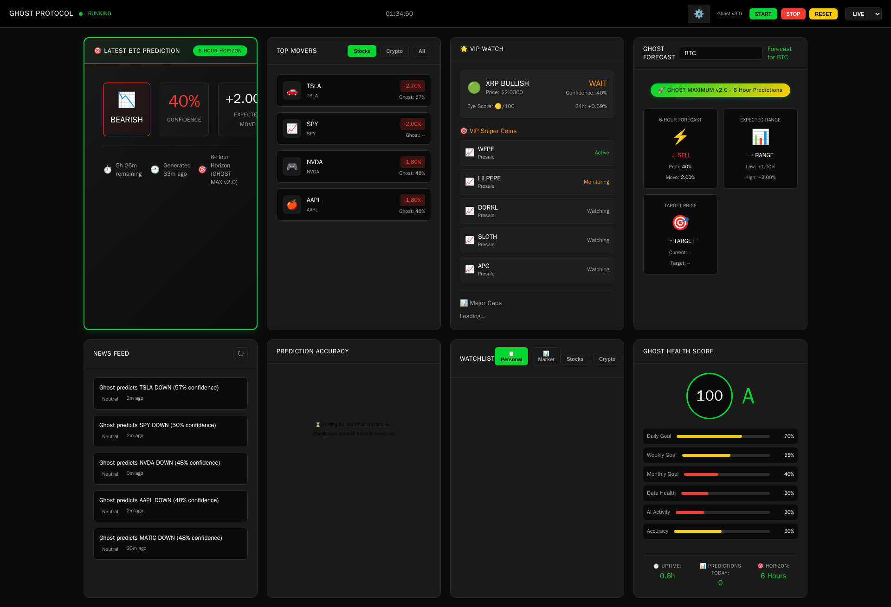
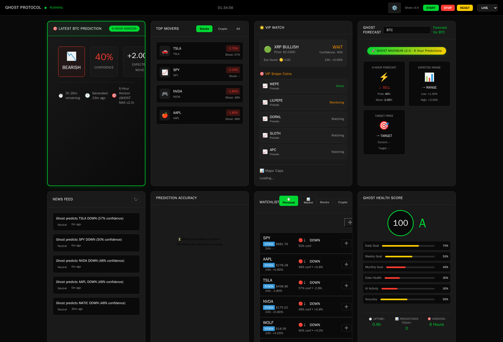

# UI Verification Audit Report

**Timestamp:** 2025-12-14T01:33:47.471134
**Base URL:** https://ghost-protocol-production.up.railway.app

---

## 1. Landing Page - FAIL

**Findings:**
- Error: Page.goto: Timeout 10000ms exceeded.
Call log:
  - navigating to "https://ghost-protocol-production.up.railway.app/", waiting until "load"


## 2. Cockpit Panels - FAIL

## 3. API Endpoints - PASS

### `/api/v3/predictions/latest`
**Description:** Latest predictions
**Status:** None
**Latency:** Nonems
**Error:** APIRequestContext.get: Timeout 30000ms exceeded.
Call log:
  - → GET https://ghost-protocol-production.up.railway.app/api/v3/predictions/latest
    - user-agent: Ghost-UI-Audit/1.0
    - accept: */*
    - accept-encoding: gzip,deflate,br


### `/api/v3/accuracy/summary`
**Description:** Accuracy metrics
**Status:** None
**Latency:** Nonems
**Error:** APIRequestContext.get: Route.fetch: Timeout 30000ms exceeded.
Call log:
  - → GET https://ghost-protocol-production.up.railway.app/cockpit
    - user-agent: Ghost-UI-Audit/1.0
    - accept: text/html,application/xhtml+xml,application/xml;q=0.9,image/avif,image/webp,image/apng,*/*;q=0.8,application/signed-exchange;v=b3;q=0.7
    - accept-encoding: gzip,deflate,br
    - upgrade-insecure-requests: 1
    - sec-ch-ua: "HeadlessChrome";v="143", "Chromium";v="143", "Not A(Brand";v="24"
    - sec-ch-ua-mobile: ?0
    - sec-ch-ua-platform: "Windows"


### `/api/v3/performance/dashboard`
**Description:** Performance dashboard
**Status:** 200
**Latency:** 4112.06ms
**Response Body:**
```json
{
  "overall": {
    "predictions": 0,
    "wins": 0,
    "losses": 0,
    "win_rate": 0,
    "avg_accuracy": 0,
    "avg_confidence": 0,
    "avg_gain_pct": 0
  },
  "today": {
    "predictions": 0,
    "wins": 0,
    "losses": 0,
    "win_rate": 0,
    "avg_gain_pct": 0
  },
  "last_7d": {
    "predictions": 0,
    "wins": 0,
    "losses": 0,
    "win_rate": 0,
    "avg_gain_pct": 0
  },
  "last_30d": {
    "predictions": 0,
    "wins": 0,
    "losses": 0,
    "win_rate": 0,
    "avg_gain_pct": 0
  },
  "by_asset_type": {
    "stocks": {
      "predictions": 0,
      "win_rate": 0
    },
    "crypto": {
      "predictions": 0,
      "win_rate": 0
    }
  },
  "recent_predictions": [],
  "top_performers": [],
  "worst_performers": [],
  "confidence_calibration": {},
  "generated_at": "2025-12-14T01:34:46.738161"
}
```

### `/api/v3/live_recalculator/status`
**Description:** Live recalculator status
**Status:** 200
**Latency:** 60.61ms
**Response Body:**
```json
{
  "ok": true,
  "enabled": true,
  "db_path": "/app/data/live_recalculator.db",
  "tables": [
    "exit_signals",
    "position_snapshots",
    "sqlite_sequence"
  ],
  "latest_ts": 0,
  "snapshots": [],
  "exit_signals": []
}
```

## 4. Console Errors - PASS

**Total Messages:** 0
**Errors:** 0
**Warnings:** 0

## 5. Reliability Micro-Loop - PASS

**Iterations:** 3

- ✓ **Iteration 1**: Success
  
- ✓ **Iteration 2**: Success
  
- ✓ **Iteration 3**: Success
  

## 6. Network Summary

**Total Requests:** 54

**Status Code Distribution:**
- 200: 54 requests

---

## Summary

**Overall Status:** ❌ FAIL

**Section Status:**
- ❌ Landing Page: FAIL
- ❌ Cockpit Panels: FAIL
- ✅ Api Endpoints: PASS
- ✅ Console Errors: PASS
- ✅ Reliability Loop: PASS